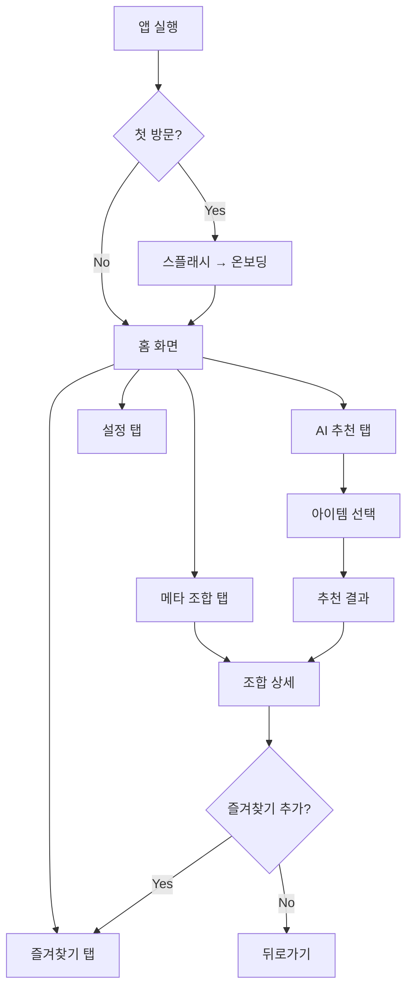
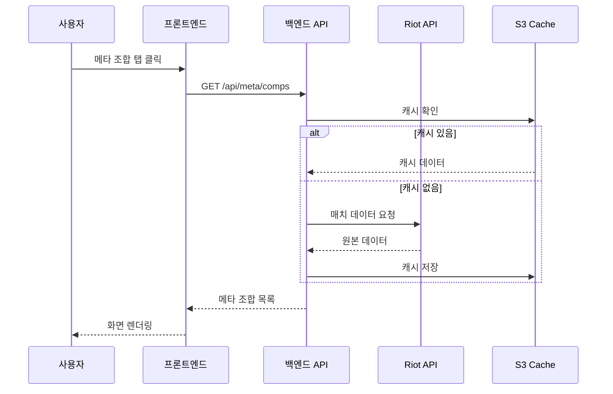
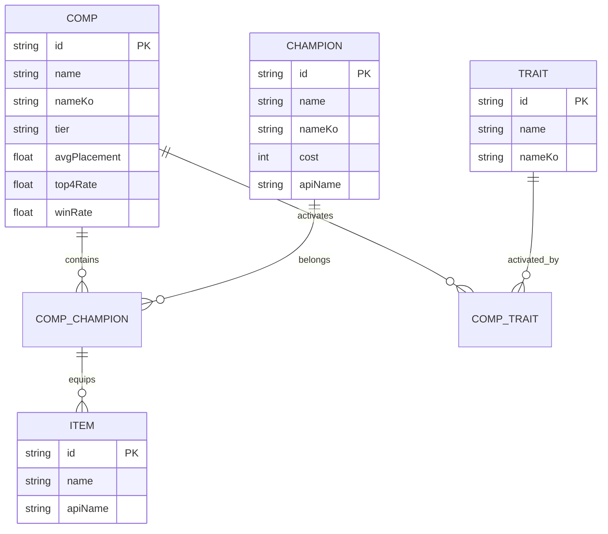
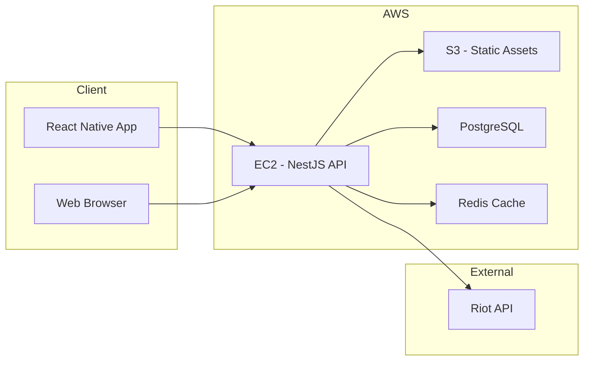
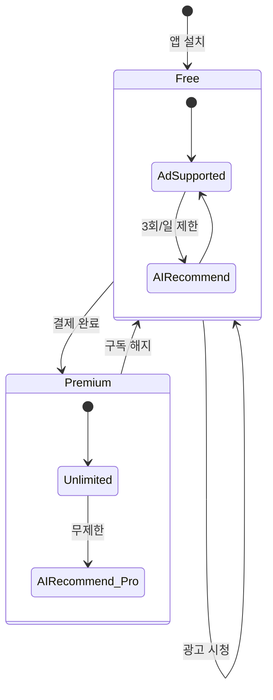
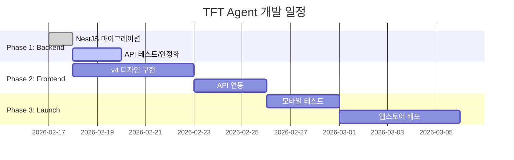
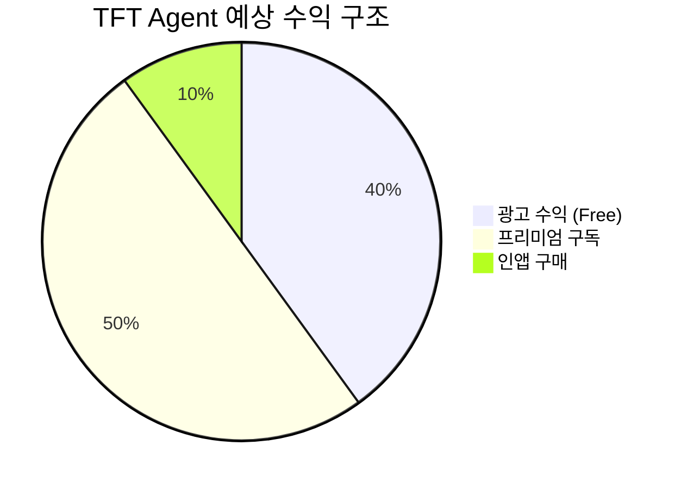

# Diagram Generator — Mermaid.js 다이어그램

## 핵심 원칙
**"글로 설명하면 3분, 그림으로 보여주면 3초."**
기획서, 위임 태스크, 아키텍처 설명에 Mermaid 다이어그램을 포함한다.

## 왜 Mermaid인가
- **텍스트 기반** → LLM이 생성/수정 가능
- **노션 지원** → `/mermaid` 블록으로 바로 렌더링
- **GitHub 지원** → `.md` 파일에서 자동 렌더링
- **버전 관리** → Git diff로 변경 추적 가능
- **깨지지 않음** → 이미지와 달리 해상도/크기 문제 없음

## 다이어그램 유형별 템플릿

### 1. 유저 플로우 (User Flow) — 가장 자주 사용

기능 기획 시 사용자가 어떤 경로로 이동하는지 시각화.



### 2. 시퀀스 다이어그램 (Sequence) — API 흐름

프론트↔백엔드 API 호출 순서 시각화. 풀스택 작업 위임 시 필수.



### 3. ERD (Entity-Relationship) — 데이터 구조

DB 설계, 데이터 모델 설명 시 사용.



### 4. 아키텍처 다이어그램 — 시스템 구조

프로젝트 전체 아키텍처 또는 인프라 시각화.



### 5. 상태 다이어그램 (State) — 프로세스 흐름

작업 상태 전이, 결제 흐름 등.



### 6. 간트 차트 (Gantt) — 일정 관리

프로젝트 마일스톤, 스프린트 계획.



### 7. 파이 차트 — 데이터 시각화



## 사용 가이드

### 기획서에 포함할 때
```markdown
## 3. 유저 플로우

아래 다이어그램은 메인 네비게이션 흐름을 보여줍니다.

```mermaid
flowchart TD
    ...
```​
```

### 노션에 붙여넣기
1. 노션에서 `/mermaid` 입력
2. 코드 블록에 Mermaid 코드 붙여넣기
3. 자동 렌더링 ✅

### GitHub에서
마크다운 파일(`.md`)의 ```mermaid 코드 블록은 자동 렌더링.

### HTML로 렌더링 (대시보드/리서치)
```html
<script src="https://cdn.jsdelivr.net/npm/mermaid/dist/mermaid.min.js"></script>
<script>mermaid.initialize({theme: 'dark'});</script>

<div class="mermaid">
flowchart TD
    A --> B
</div>
```

## 이서의 사용 규칙

### 반드시 다이어그램 포함하는 경우
- **풀스택 위임 시**: 시퀀스 다이어그램 (프론트↔백 API 흐름)
- **새 기능 기획 시**: 유저 플로우
- **데이터 구조 변경 시**: ERD
- **프로젝트 킥오프 시**: 아키텍처 + 간트 차트

### 다이어그램 포함 안 해도 되는 경우
- 단순 버그 수정
- 텍스트/스타일 수정
- 단일 API 엔드포인트 추가

## 스타일 가이드
- 노드 텍스트는 **한국어** 우선 (사장님 리뷰용)
- 기술 용어는 영문 허용 (API, DB, Redis 등)
- 색상: Mermaid 기본 테마 사용 (노션/GitHub 호환성)
- 복잡한 다이어그램은 subgraph로 그룹화
