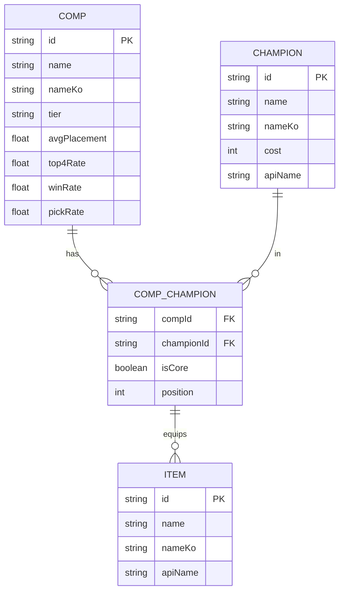

# Data Integrity — 데이터 무결성

## 핵심 원칙
**화면이 깨지는 건 고치면 되지만, 데이터가 꼬이면 치명적이다.**

## 현재 데이터 구조 (TFT Agent)

### 파일 기반 데이터 (현재)
```
/home/ubuntu/tft-agent-backend/data/
├── meta/
│   └── comps.json        # 메타 조합 데이터
├── champions/
│   └── champions.json    # 챔피언 목록
├── i18n/
│   ├── ko_KR/
│   │   ├── champions.json
│   │   └── traits.json
│   └── en_US/
│       ├── champions.json
│       └── traits.json
└── items/
    └── items.json        # 아이템 목록
```

### DB 마이그레이션 계획 (Phase 2)
- PostgreSQL + Prisma ORM
- Redis 캐시 (5min TTL)

## 입력 값 검증 — 모든 엔드포인트에 필수

### Fastify Schema Validation
```javascript
// 요청 스키마 정의
const recommendSchema = {
  body: {
    type: 'object',
    required: ['items'],
    properties: {
      items: {
        type: 'array',
        minItems: 1,
        maxItems: 10,
        items: { type: 'string' }
      }
    }
  }
};

fastify.post('/api/recommend/by-items', {
  schema: recommendSchema,
  handler: async (request, reply) => {
    // 스키마 통과된 안전한 데이터
    const { items } = request.body;
    // ...
  }
});
```

### 수동 검증 패턴 (스키마 외)
```javascript
// 문자열 소독
function sanitize(str) {
  if (typeof str !== 'string') return '';
  return str.trim().slice(0, 200); // 길이 제한
}

// ID 형식 검증
function isValidId(id) {
  return typeof id === 'string' && /^[a-zA-Z0-9_-]+$/.test(id);
}

// 숫자 범위 검증
function clamp(num, min, max) {
  return Math.max(min, Math.min(max, Number(num) || min));
}
```

## 데이터 파일 무결성

### JSON 파일 읽기 — 안전한 패턴
```javascript
function loadJsonSafe(filePath) {
  try {
    const raw = fs.readFileSync(filePath, 'utf-8');
    const data = JSON.parse(raw);
    if (!data || (Array.isArray(data) && data.length === 0)) {
      console.warn(`⚠️ Empty data: ${filePath}`);
    }
    return data;
  } catch (error) {
    console.error(`❌ Failed to load ${filePath}:`, error.message);
    return null; // 빈 배열/객체 대신 null → 호출자가 처리
  }
}
```

### JSON 파일 쓰기 — 원자적(Atomic) 패턴
```javascript
function writeJsonSafe(filePath, data) {
  const tmpPath = filePath + '.tmp';
  try {
    fs.writeFileSync(tmpPath, JSON.stringify(data, null, 2), 'utf-8');
    fs.renameSync(tmpPath, filePath); // 원자적 교체
  } catch (error) {
    // tmp 파일 정리
    if (fs.existsSync(tmpPath)) fs.unlinkSync(tmpPath);
    throw error;
  }
}
```

## ERD 시각화 (Mermaid)

데이터 구조 변경 시 ERD를 마크다운으로 작성:


## ⚠️ 절대 규칙
- 사용자 입력을 검증 없이 쿼리/파일에 사용하지 않는다
- JSON 파일 직접 쓰기 시 반드시 atomic write
- 데이터 구조 변경 시 매니저(이서)에게 보고 (프론트에 영향)
- 환경변수(.env)에 비밀 정보 — 코드에 하드코딩 절대 금지
